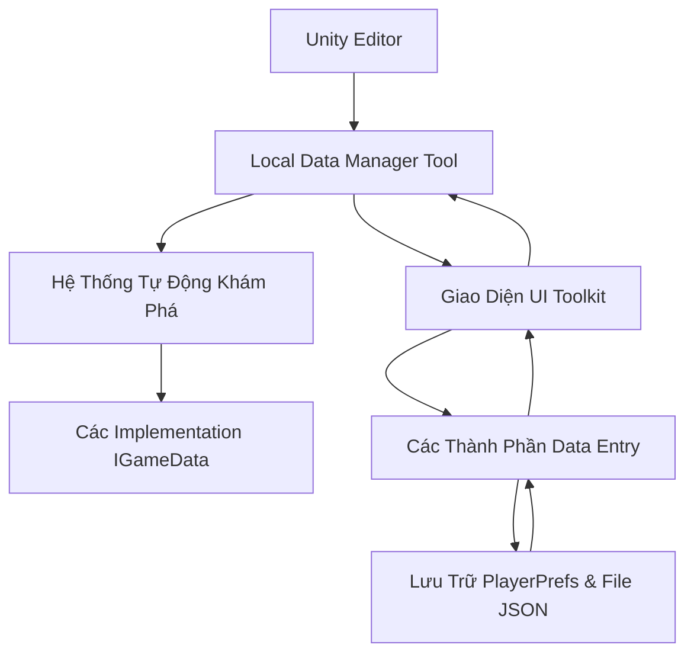

# 🎮 Local Data Manager

> 💡 **Công cụ Unity Editor mạnh mẽ để quản lý dữ liệu game lưu trong PlayerPrefs và file JSON với giao diện UI Toolkit đẹp mắt**

---

## 📖 Tổng Quan

Công cụ này cung cấp **quyền kiểm soát hoàn toàn dữ liệu PlayerPrefs và file JSON** của bạn thông qua giao diện trực quan trực quan. Nó tự động phát hiện tất cả các class `[Serializable]` của bạn implement `IGameData` và cho phép bạn **chỉnh sửa chúng giống như các trường trong Unity Inspector**.

### ⭐ Tính Năng Chính
- 🔍 **Phát Hiện JSON Thông Minh**: Tự động quét PlayerPrefs và file JSON để tìm dữ liệu có sẵn
- ✨ **Tự Động Khám Phá**: Tìm tất cả các implementation `IGameData` và ghép nối với dữ liệu đã lưu
- 🎨 **Giao Diện Đẹp Mắt**: Giao diện UI Toolkit hiện đại với theme tối
- 📝 **Chỉnh Sửa Trực Tiếp**: Chỉnh sửa giá trị dữ liệu giống như các trường Unity Inspector
- 💾 **Kiểm Soát Chi Tiết**: Load/save từng loại dữ liệu riêng lẻ hoặc tất cả cùng lúc
- 🔧 **Ghép Nối Key Linh Hoạt**: Tìm dữ liệu sử dụng nhiều mẫu đặt tên khác nhau
- 📄 **Xử Lý JSON Nâng Cao**: Serialization/deserialization mạnh mẽ với xử lý lỗi
- 🔒 **Thao Tác An Toàn**: Validation và dialog xác nhận cho tất cả các thao tác
- 🚀 **Đa Nền Tảng**: Hoạt động trên Windows, Mac, và Linux với tối ưu hóa cụ thể cho từng nền tảng

### 🎯 Trường Hợp Sử Dụng
- 📱 **Debug tiến trình người chơi** trong quá trình phát triển
- 🎮 **Test các trạng thái game khác nhau** mà không cần chơi qua nội dung
- 🌟 **Reset dữ liệu cụ thể** mà không mất mọi thứ
- 🔧 **Chỉnh sửa dữ liệu lưu** để test các trường hợp biên

### 📋 Yêu Cầu Hệ Thống
- 🔧 Unity version: `2022.3+` (để hỗ trợ UI Toolkit)
- 📦 Required packages: `Newtonsoft.Json` (cho serialization)
- ⚙️ Dependencies: Classes phải implement [`IGameData`](./MicroData/IGameData.cs)

---

> 💡 **Bắt Đầu Nhanh**: Mở công cụ qua `Tools → Foundations → Local Data Editor → PlayerPref → PlayerPrefs Data Manager`

---

## 🏗️ Các Thành Phần Của Tool

> 🎨 Tool này tuân theo **các pattern Unity Editor hiện đại** với UI Toolkit

### 📂 Cấu Trúc Thư Mục

```
DataFlow/
├── 📦 MicroData/               # Giao diện cốt lõi
│   └── IGameData.cs           # Giao diện cơ sở cho dữ liệu game
├── 📁 Editor/                 # Triển khai tool
│   ├── PlayerPrefsDataTool.cs        # Cửa sổ editor chính
│   ├── PlayerPrefsDataEntry.cs       # Quản lý data entry
│   ├── FileDataEntry.cs             # Quản lý file data entry
│   ├── PlayerPrefsDataTool.uxml      # Layout UI
│   └── PlayerPrefsDataTool.uss       # Styling
└── 📚 README.md               # Tài liệu này
```

---

### 🔧 Thành Phần Cốt Lõi

#### 📦 MicroData/
> 🎯 **Định nghĩa giao diện cốt lõi cho dữ liệu game**

- 📄 **[`IGameData.cs`](./MicroData/IGameData.cs)**: Giao diện cơ sở mà tất cả dữ liệu game phải implement

#### 📁 Editor/
> 🎯 **Triển khai tool hoàn chỉnh với UI Toolkit**

- 📄 **[`PlayerPrefsDataTool.cs`](./Editor/PlayerPrefsDataTool.cs)**: Cửa sổ editor chính với hệ thống discovery dựa trên reflection
- 📄 **[`PlayerPrefsDataEntry.cs`](./Editor/PlayerPrefsDataEntry.cs)**: Data entry riêng lẻ với tạo UI động
- 📄 **[`FileDataEntry.cs`](./Editor/FileDataEntry.cs)**: Quản lý dữ liệu file JSON với UI động
- 📄 **[`PlayerPrefsDataTool.uxml`](./Editor/PlayerPrefsDataTool.uxml)**: Layout UI hiện đại với thiết kế responsive
- 📄 **[`PlayerPrefsDataTool.uss`](./Editor/PlayerPrefsDataTool.uss)**: Styling theme tối đẹp mắt

---

### 📊 Luồng Kiến Trúc



> 💡 **Cách hoạt động**: Tool quét tất cả assemblies để tìm các class `[Serializable]` implement `IGameData`, sau đó tạo UI động cho từng class

---

## 📖 Hướng Dẫn Sử Dụng

### 🚀 Bắt Đầu Nhanh

> ⏱️ **Thời gian setup**: ~2 phút

#### 1️⃣ Mở Tool
```
📁 Unity Menu Bar
└── Tools → Foundations → Local Data Editor → PlayerPref → PlayerPrefs Data Manager
```

#### 2️⃣ Các Class Dữ Liệu Của Bạn
Đảm bảo các class dữ liệu của bạn tuân theo pattern này:
```csharp
[Serializable]
public class PlayerProgressData : IGameData
{
    [JsonIgnore]
    public int Version => 1;
    
    public int currentLevel = 1;
    public float experiencePoints = 0f;
    public bool hasCompletedTutorial = false;
    public string playerName = "Player";
}
```

#### 3️⃣ Load và Chỉnh Sửa
- 🔍 Tool **tự động quét PlayerPrefs và file JSON** để tìm dữ liệu có sẵn khi khởi động
- 🎮 Click **"📥 Load All Data"** để load dữ liệu đã phát hiện vào UI
- ✏️ Mở rộng bất kỳ data entry nào để chỉnh sửa giá trị theo thời gian thực
- 💾 Click **"💾 Save All Data"** hoặc sử dụng các nút save riêng lẻ
- 🔧 Tool tự động ghép nối dữ liệu JSON với các type `IGameData` của bạn

> 💡 **Phát Hiện Thông Minh**: Tool tìm dữ liệu sử dụng nhiều pattern key như `GameData_TypeName`, `TypeName`, `Data_TypeName`, v.v.

---

### 🧪 Test Với Dữ Liệu Mẫu

#### Setup Test Nhanh Với JsonPlayerPrefsExample

> ⏱️ **Thời gian setup test**: ~1 phút

Muốn xem tool hoạt động ngay lập tức? Sử dụng script mẫu được cung cấp:

**Bước 1: Thêm Script Test**
1. 📁 Tìm [`TestPlayerPrefsData.cs`](./Examples/TestPlayerPrefsData.cs) trong thư mục Examples
2. 🎮 Thêm nó vào bất kỳ GameObject nào trong scene của bạn  
3. ✅ Đảm bảo các class dữ liệu mẫu có trong project của bạn (chúng đã được bao gồm!)

**Bước 2: Tạo Dữ Liệu Test**
```csharp
// Trong Inspector hoặc qua Context Menu
TestPlayerPrefsData → "Create Sample PlayerPrefs Data"
```

**Thay thế: Kiểm Tra Dữ Liệu Có Sẵn**
```csharp
// Xem những gì đã được lưu
TestPlayerPrefsData → "Show Existing PlayerPrefs"
```

**Bước 3: Mở Tool và Load**
1. 🔧 `Tools → Foundations → Local Data Editor → PlayerPref → PlayerPrefs Data Manager`
2. 📥 Click "Load All Data"  
3. 🎉 Xem dữ liệu của bạn được load và sẵn sàng để chỉnh sửa!

**Những Gì Được Tạo:**
- 📊 `PlayerProgressData` - Level người chơi, XP, stats
- 💰 `InventoryData` - Vàng, items, equipment  
- ⚙️ `GameSettings` - Audio, graphics, controls
- 🏆 `AchievementData` - Achievement đã mở khóa  
- 🎮 `GameConfiguration` - Độ khó, cài đặt world

> 💡 **Mẹo Pro**: Sử dụng các format key khác nhau để test khả năng phát hiện thông minh của tool:
> ```csharp
> PlayerPrefs.SetString("GameData_PlayerProgressData", json);  // Chuẩn
> PlayerPrefs.SetString("PlayerData", json);                   // Ngắn gọn
> PlayerPrefs.SetString("Save_PlayerProgress", json);          // Có prefix
> ```

---

### 💻 Sử Dụng Cơ Bản

#### 🎮 Làm Việc Với Các Data Entry Riêng Lẻ

> 📄 **Mỗi loại dữ liệu có phần có thể mở rộng riêng**

```csharp
// Class dữ liệu của bạn tự động xuất hiện trong tool
[Serializable]
public class InventoryData : IGameData
{
    [JsonIgnore]
    public int Version => 1;
    
    public int goldCoins = 100;
    public List<string> itemIds = new List<string>();
    public bool hasRareItem = false;
}
```

**Các bước để quản lý dữ liệu này:**
1. 📦 **Tìm entry** - Tìm "📦 InventoryData" trong tool
2. 🖱️ **Click để mở rộng** - Click header để hiện/ẩn các trường
3. ✏️ **Chỉnh sửa giá trị** - Sửa đổi `goldCoins`, `hasRareItem`, v.v.
4. 💾 **Lưu thay đổi** - Sử dụng nút "💾 Save" riêng lẻ hoặc "Save All"

#### 🚀 Thao Tác Nâng Cao

> 📄 **Thao tác hàng loạt để hiệu quả**

```csharp
// Tool xử lý nhiều loại dữ liệu một cách mượt mà
[Serializable] public class PlayerStats : IGameData { /* ... */ }
[Serializable] public class GameSettings : IGameData { /* ... */ }
[Serializable] public class AchievementData : IGameData { /* ... */ }

// Cả ba sẽ tự động xuất hiện trong tool!
```

**Thao tác hàng loạt:**
- 📥 **Load All** - Load tất cả loại dữ liệu đã phát hiện từ PlayerPrefs và file JSON
- 💾 **Save All** - Lưu tất cả dữ liệu đã sửa đổi về PlayerPrefs và file JSON  
- 🗑️ **Clear All** - Xóa TẤT CẢ dữ liệu PlayerPrefs và file JSON (có xác nhận)

---

### 🎯 Các Trường Hợp Sử Dụng Phổ Biến

#### Trường Hợp 1: Test Các Level Người Chơi Khác Nhau
> 📄 **Test nhanh nội dung level cao mà không cần grind**

1. 📥 Load `PlayerProgressData` của bạn
2. ✏️ Thay đổi `currentLevel` thành `50`
3. ✏️ Đặt `experiencePoints` thành `999999`
4. 💾 Lưu dữ liệu
5. ▶️ Chơi game của bạn - bây giờ bạn đã level 50!

#### Trường Hợp 2: Debug Các Vấn Đề Hệ Thống Save
> 📄 **Kiểm tra chính xác dữ liệu đang được lưu**

1. 🎮 Chơi game và save bình thường
2. 📥 Mở tool và load tất cả dữ liệu
3. 🔍 Kiểm tra tất cả giá trị để xác minh chúng đúng
4. ✏️ Sửa thủ công bất kỳ giá trị nào không đúng
5. 💾 Lưu lại vào PlayerPrefs

#### Trường Hợp 3: Reset Dữ Liệu Cụ Thể
> 📄 **Xóa chỉ một số dữ liệu nhất định mà không mất mọi thứ**

1. 📦 Tìm data entry cụ thể bạn muốn reset
2. ✏️ Mở rộng nó và reset các giá trị về mặc định
3. 💾 Lưu chỉ entry đó
4. 🎮 Các dữ liệu khác vẫn không bị ảnh hưởng

---

### 📚 Tham Khảo Menu Items

| Menu Item                                                                                 | Shortcut | Mô Tả |
|-------------------------------------------------------------------------------------------|----------|-------------|
| `Tools → Foundations → Local Data Editor → PlayerPref → PlayerPrefs Data Manager`         | - | Mở cửa sổ tool chính |
| `Tools → Foundations → Local Data Editor → PlayerPref → Refresh PlayerPrefs Data Manager` | - | Quét lại để tìm các type IGameData mới và PlayerPrefs keys |
| `Tools → Foundations → Local Data Editor → PlayerPref → Open PlayerPrefs Location`        | - | Hiển thị nơi PlayerPrefs được lưu trữ trên hệ thống của bạn |
| `Tools → Foundations → Local Data Editor → PlayerPref → Debug PlayerPrefs Scanner`                                        | - | **MỚI!** Quét và ghi log tất cả PlayerPrefs keys để debug |

### 🔍 Công Cụ Debug

#### Debug PlayerPrefs Scanner

> 🎯 **Hoàn hảo để troubleshoot** - hiển thị chính xác những gì có trong PlayerPrefs

```
🔧 Tools → Foundations → Local Data Editor → PlayerPref → Debug PlayerPrefs Scanner
```

**Những gì nó làm:**
- 📋 Liệt kê TẤT CẢ PlayerPrefs keys được tìm thấy
- 📄 Hiển thị key nào chứa JSON hợp lệ
- 🎯 Cố gắng ghép nối dữ liệu JSON với các type IGameData của bạn
- 📊 Cung cấp output Console chi tiết để chẩn đoán

**Output Mẫu:**
```
📦 Tìm thấy 3 IGameData types: PlayerProgressData, InventoryData, GameSettings
🔑 Tìm thấy tổng cộng 5 PlayerPrefs keys  
📄 Key: 'GameData_PlayerProgressData' | JSON: True | Length: 247
✅ Ghép nối thành công 'GameData_PlayerProgressData' → PlayerProgressData
📄 Key: 'SomeOtherKey' | JSON: False | Length: 12
```

---

## 🎮 Setup Unity GameObject

> ⚠️ **Lưu ý**: Tool này chỉ dành cho **editor** và không yêu cầu bất kỳ GameObjects nào trong scenes của bạn

### 📦 Không Cần Setup GameObject!

Đây là một **Unity Editor tool** thuần túy hoạt động hoàn toàn thông qua giao diện Editor. Bạn không cần:
- ❌ Thêm bất kỳ GameObjects nào vào scenes
- ❌ Gắn bất kỳ components nào
- ❌ Cấu hình bất kỳ prefabs nào

### ⚙️ Yêu Cầu Data Class

Thay vào đó, chỉ cần đảm bảo các data class của bạn tuân theo pattern này:

```csharp
using System;
using Newtonsoft.Json;
using Foundations.DataFlow.MicroData;

[Serializable]  // ✅ Phải có serializable
public class YourGameData : IGameData  // ✅ Phải implement IGameData
{
    [JsonIgnore]  // ✅ Bắt buộc cho Version property
    public int Version => 1;
    
    // ✅ Các trường dữ liệu thực tế của bạn
    public string playerName = "";
    public int level = 1;
    public float health = 100f;
    public bool isAlive = true;
}
```

**Yêu cầu:**
- ✅ **Phải có attribute `[Serializable]`**
- ✅ **Phải implement interface `IGameData`**
- ✅ **Version property phải có `[JsonIgnore]`**
- ✅ **Các fields nên là public để chỉnh sửa trong UI**

---

## 📚 Tham Khảo API

> 📄 **Các class chính và API công khai của chúng**

---

### 🎮 PlayerPrefsDataTool Class

> 📄 **Nguồn**: [`Editor/PlayerPrefsDataTool.cs`](./Editor/PlayerPrefsDataTool.cs)

#### 🔧 Static Methods

##### `ShowWindow()`

> 🎯 **Mục đích**: Mở cửa sổ PlayerPrefs Data Manager

**Cách sử dụng:**
```csharp
// Mở bằng code
PlayerPrefsDataTool.ShowWindow();
```

---

##### `RefreshTool()`

> 🎯 **Mục đích**: Quét lại assemblies để tìm các implementation IGameData mới

**Cách sử dụng:**
```csharp
// Refresh sau khi thêm data class mới
PlayerPrefsDataTool.RefreshTool();
```

---

##### `OpenPlayerPrefsLocation()`

> 🎯 **Mục đích**: Hiển thị nơi PlayerPrefs được lưu trữ trên nền tảng hiện tại

**Các nền tảng:**
- 🪟 **Windows**: Vị trí Registry
- 🍎 **Mac**: Vị trí file .plist  
- 🐧 **Linux**: Thông tin cụ thể nền tảng

---

### 🎮 PlayerPrefsDataEntry Class

> 📄 **Nguồn**: [`Editor/PlayerPrefsDataEntry.cs`](./Editor/PlayerPrefsDataEntry.cs)

#### 📊 Public Properties

##### `DataType`

> 🎯 **Mục đích**: Lấy Type của data class được quản lý

**Type:** `Type`

**Cách sử dụng:**
```csharp
var entry = new PlayerPrefsDataEntry(typeof(PlayerData));
Debug.Log($"Đang quản lý: {entry.DataType.Name}");
```

---

##### `HasData`

> 🎯 **Mục đích**: Kiểm tra xem entry này hiện có dữ liệu đã load hay không

**Type:** `bool`

**Cách sử dụng:**
```csharp
if (entry.HasData)
{
    Debug.Log("Dữ liệu đã được load và sẵn sàng để chỉnh sửa");
}
```

---

#### 🔧 Public Methods

##### `LoadData()`

> 🎯 **Mục đích**: Load dữ liệu từ PlayerPrefs cho type cụ thể này

**Ví dụ:**
```csharp
// Load chỉ data type này
entry.LoadData();

// Kiểm tra xem có thành công không
if (entry.HasData)
{
    Debug.Log("✅ Dữ liệu đã được load thành công");
}
```

---

##### `SaveData()`

> 🎯 **Mục đích**: Lưu dữ liệu hiện tại vào PlayerPrefs cho type cụ thể này

**Ví dụ:**
```csharp
// Lưu chỉ data type này
entry.SaveData();
```

---

##### `DeleteData()`

> 🎯 **Mục đích**: Xóa data type này khỏi PlayerPrefs

**Ví dụ:**
```csharp
// Xóa data type cụ thể này
entry.DeleteData();
```

---

### 🔔 Events

#### `OnDataChanged`

> 🎯 **Mục đích**: Được kích hoạt khi người dùng chỉnh sửa dữ liệu trong UI

**Event Type:** `Action<PlayerPrefsDataEntry>`

**Cách sử dụng:**
```csharp
entry.OnDataChanged += (modifiedEntry) =>
{
    Debug.Log($"Người dùng đã chỉnh sửa {modifiedEntry.TypeName}");
};
```

---

## ⚙️ Tùy Chọn Cấu Hình

### 🎨 Các Loại Dữ Liệu Được Hỗ Trợ

Tool tự động tạo các trường UI phù hợp cho các loại dữ liệu này:

| C# Type | UI Element | Ví Dụ Giá Trị |
|---------|------------|---------------|
| `int` | Integer Field | `42` |
| `float` | Float Field | `3.14f` |
| `string` | Text Field | `"Hello World"` |
| `bool` | Toggle | `true/false` |
| `Vector2` | Vector2 Field | `(1, 2)` |
| `Vector3` | Vector3 Field | `(1, 2, 3)` |
| `Color` | Color Picker | `Red, Blue, etc.` |
| `Enum` | Enum Dropdown | `YourEnumValue` |

---

### 🔧 Cài Đặt Serialization

#### Cấu Hình JSON Serialization

Tool sử dụng **Newtonsoft.Json** cho serialization với các cài đặt này:

```csharp
// Tự động format để PlayerPrefs dễ đọc
var jsonData = JsonConvert.SerializeObject(data, Formatting.Indented);

// Tôn trọng các attribute [JsonIgnore]
[JsonIgnore]
public int Version => 1;  // Điều này sẽ không được lưu vào PlayerPrefs
```

**Lợi ích:**
- ✅ **JSON dễ đọc** trong PlayerPrefs
- ✅ **Xử lý đúng** các Unity types (Vector3, Color, v.v.)
- ✅ **Hỗ trợ attributes** ([JsonIgnore], [JsonProperty])

---

### 📁 Pattern Lưu Trữ Dữ Liệu

#### Phát Hiện PlayerPrefs Key

Tool thông minh quét dữ liệu JSON sử dụng **nhiều pattern key**:

**Pattern Chính:**
```
GameData_{TypeName}
```

**Các Pattern Thay Thế Được Phát Hiện:**
- `TypeName` (ví dụ: `PlayerProgressData`)
- `Data_TypeName` (ví dụ: `Data_PlayerProgressData`)
- `Save_TypeName` (ví dụ: `Save_PlayerProgressData`)
- `Player_TypeName` (ví dụ: `Player_PlayerProgressData`)
- `TypeNameData` (ví dụ: `PlayerProgressData`)
- `TypeNameConfig` (ví dụ: `PlayerProgressConfig`)

**Ghép Nối Thông Minh:**
- ✅ **Validation JSON**: Chỉ xử lý các key chứa JSON hợp lệ
- ✅ **Tương Thích Type**: Cố gắng deserialization để đảm bảo dữ liệu khớp
- ✅ **Quét Fallback**: Quét tất cả PlayerPrefs keys như phương án cuối
- ✅ **Đa Nền Tảng**: Hoạt động trên Windows (Registry), Mac (plist), Linux

**Ví dụ:**
```csharp
// Tất cả các key này sẽ được phát hiện cho PlayerProgressData:
PlayerPrefs.SetString("GameData_PlayerProgressData", json);  // ✅ Chính
PlayerPrefs.SetString("PlayerProgressData", json);           // ✅ Trực tiếp
PlayerPrefs.SetString("Data_PlayerProgressData", json);      // ✅ Có prefix
PlayerPrefs.SetString("PlayerProgress", json);               // ✅ Rút gọn
```

Cách tiếp cận linh hoạt này hoạt động với **bất kỳ hệ thống save hiện có nào** mà không cần thay đổi code!

---

### 🎨 Tùy Chỉnh UI

#### CSS Classes Để Styling

Bạn có thể sửa đổi [`PlayerPrefsDataTool.uss`](./Editor/PlayerPrefsDataTool.uss) để tùy chỉnh giao diện:

```css
/* Styling button chính */
.primary-button {
    background-color: rgb(88, 166, 255);  /* Theme xanh */
    border-radius: 6px;
    padding: 8px 16px;
}

/* Styling data entry */
.data-entry {
    background-color: rgb(64, 64, 64);    /* Theme tối */
    border-radius: 6px;
    margin-bottom: 8px;
}
```

**Các class chính bạn có thể sửa đổi:**
- `.primary-button`, `.success-button`, `.danger-button` - Màu button
- `.data-entry`, `.data-entry-header` - Giao diện data entry
- `.property-field`, `.property-value` - Styling trường

---

## 🔧 Xử Lý Sự Cố

### 🐛 Các Vấn Đề Thường Gặp

#### ❌ Vấn Đề #1: "Tool không hiển thị dữ liệu đã lưu"

> 🔍 **Triệu chứng**: Tool mở nhưng không hiển thị dữ liệu PlayerPrefs có sẵn

**✅ Giải pháp:**

##### Bước 1: Sử Dụng Debug Scanner
```
🔧 Tools → Foundations → Debug PlayerPrefs Scanner
```
Điều này sẽ quét và ghi log TẤT CẢ PlayerPrefs keys và hiển thị key nào chứa dữ liệu JSON.

##### Bước 2: Kiểm Tra Console Output
Tìm các thông báo debug này:
- `🔍 Tìm thấy X tổng cộng PlayerPrefs keys`
- `📄 Tìm thấy JSON key: 'YourKey' (1234 chars)`
- `✅ Ghép nối thành công 'YourKey' → YourType`

##### Bước 3: Xác Minh Format Dữ Liệu
PlayerPrefs JSON của bạn nên trông như thế này:
```json
{
  "playerName": "TestPlayer",
  "currentLevel": 15,
  "experiencePoints": 2500.0
}
```

##### Bước 4: Thử Load Thủ Công
1. 📥 Click nút **"Load All Data"**
2. 🔄 Nếu vẫn không có gì, click **"Refresh PlayerPrefs Data Manager"**
3. 📋 Mở rộng các data entry riêng lẻ để xem chúng đã load chưa

---

#### ❌ Vấn Đề #2: "Không tìm thấy data types"

> 🔍 **Triệu chứng**: Tool hiển thị thông báo "📁 No Data Found"

**✅ Giải pháp:**

##### Bước 1: Kiểm Tra Data Classes Của Bạn
```csharp
// ❌ Thiếu yêu cầu
public class PlayerData : IGameData  // Thiếu [Serializable]!
{
    public int Version => 1;  // Thiếu [JsonIgnore]!
    public int level = 1;
}

// ✅ Implementation đúng
[Serializable]  // Phải có cái này!
public class PlayerData : IGameData
{
    [JsonIgnore]  // Phải có cái này!
    public int Version => 1;
    
    public int level = 1;
}
```

##### Bước 2: Xác Minh Assembly Loading
- 🔍 Kiểm tra Console cho lỗi "ReflectionTypeLoadException"
- 🔄 Thử `Tools → Foundations → Local Data Editor → PlayerPref → Refresh PlayerPrefs Data Manager`
- 🛠️ Rebuild project của bạn (`Build → Clean Solution`)

---

#### ❌ Vấn Đề #3: "Dữ liệu không lưu đúng"

> 🔍 **Triệu chứng**: Thay đổi trong tool không được lưu trong game

**✅ Giải pháp:**

##### Bước 1: Kiểm Tra PlayerPrefs Keys
```csharp
// Xác minh game của bạn load dữ liệu theo cách tương tự
var key = "GameData_PlayerProgressData";  // Cùng format với tool
var jsonData = PlayerPrefs.GetString(key);
var data = JsonConvert.DeserializeObject<PlayerProgressData>(jsonData);
```

##### Bước 2: Xác Minh Tương Thích Serialization  
- ✅ Sử dụng **Newtonsoft.Json** trong game code của bạn cũng vậy
- ✅ Giữ cùng tên field và types
- ✅ Test với dữ liệu đơn giản trước

---

#### ❌ Vấn Đề #4: "UI fields không cập nhật"

> 🔍 **Triệu chứng**: Thay đổi giá trị trong tool không phản ánh trong UI

**✅ Giải pháp:**

##### Bước 1: Kiểm Tra Data Binding
- 📥 Thử **"Load All Data"** để refresh UI
- 🔄 Đóng và mở lại cửa sổ tool
- 🎯 Đảm bảo bạn đang chỉnh sửa data entry đã mở rộng

##### Bước 2: Xác Minh Field Types
```csharp
// ✅ Các types được hỗ trợ
public int intValue = 0;        // Tạo IntegerField
public string textValue = "";   // Tạo TextField  
public bool boolValue = false;  // Tạo Toggle

// ❌ Types không được hỗ trợ (fallback về TextField)
public Dictionary<string, int> complexType;  // Không được hỗ trợ trực tiếp
public CustomClass customObject;             // Không được hỗ trợ trực tiếp
```

---

#### ❌ Vấn Đề #5: "Cửa sổ tool trống"

> 🔍 **Lỗi**: Cửa sổ mở nhưng không hiển thị nội dung

**✅ Giải pháp:**

##### Bước 1: Kiểm Tra Vị Trí File UXML
```
📁 Cấu Trúc Project
└── Assets/Foundations/DataFlow/Editor/
    ├── PlayerPrefsDataTool.uxml     ✅ Phải ở đây
    ├── PlayerPrefsDataTool.uss      ✅ Phải ở đây  
    └── PlayerPrefsDataTool.cs       ✅ Phải ở đây
```

##### Bước 2: Xác Minh Package Dependencies
- 📦 Kiểm tra **Package Manager** → `Newtonsoft.Json` đã cài đặt
- 🔧 Unity version `2022.3+` để hỗ trợ UI Toolkit đầy đủ

---

### 🔍 Mẹo Debug

#### Bật Detailed Logging
Tool tự động ghi log thông tin chi tiết vào Console:
```
✅ PlayerPrefs Data Manager khởi tạo thành công
🔍 Tìm thấy 3 data types: PlayerData, InventoryData, SettingsData
✅ Load All Data hoàn thành: 2 loaded, 0 errors
```

#### Kiểm Tra PlayerPrefs Thủ Công
```csharp
// Xác minh dữ liệu tồn tại trong PlayerPrefs
var key = "GameData_YourDataType";
if (PlayerPrefs.HasKey(key))
{
    var json = PlayerPrefs.GetString(key);
    Debug.Log($"JSON đã lưu: {json}");
}
```

#### Sử Dụng Menu Helpers
- 🔄 **Refresh Tool**: `Tools → Foundations → Local Data Editor → PlayerPref → Refresh PlayerPrefs Data Manager`
- 📂 **Check Location**: `Tools → Foundations → Local Data Editor → PlayerPref → Open PlayerPrefs Location`

---

### 📖 Tham Khảo Error Messages

| Error Message | Nguyên Nhân | Giải Pháp |
|---------------|-------|----------|
| `Could not load PlayerPrefsDataTool.uxml` | File UXML bị thiếu | Kiểm tra vị trí file và reimport |
| `ReflectionTypeLoadException` | Vấn đề loading assembly | Rebuild project, kiểm tra dependencies |
| `JsonSerializationException` | Lỗi format dữ liệu | Xóa PlayerPrefs và bắt đầu lại |
| `No data types found` | Không có implementation IGameData | Thêm [Serializable] và implement IGameData |

---

### 💬 Nhận Trợ Giúp

#### 🆘 Vẫn gặp vấn đề?

- 📖 **Kiểm tra Console**: Tìm thông báo lỗi chi tiết với thông tin quét JSON
- 🔄 **Thử refresh**: Sử dụng menu item refresh để quét lại PlayerPrefs keys
- 🧹 **Bắt đầu sạch**: Xóa tất cả PlayerPrefs và bắt đầu lại
- 🧪 **Test với examples**: Sử dụng [`JsonPlayerPrefsExample.cs`](./Examples/JsonPlayerPrefsExample.cs) để tạo dữ liệu test
- 📧 **Báo cáo bugs**: Bao gồm Unity version, thông báo lỗi, và các bước để reproduce

#### 📝 Khi báo cáo vấn đề, bao gồm:
- ✅ Unity version (ví dụ: `2022.3.12f1`)
- ✅ Tool version và vị trí files
- ✅ Code data class của bạn
- ✅ Console error messages
- ✅ Screenshots của vấn đề

> 🔗 **Thêm trợ giúp**: Kiểm tra Unity Console để xem thông báo lỗi chi tiết và stack traces

---

## 🎉 Tóm Tắt

### ✅ Những Gì Bạn Nhận Được:
1. 🎮 **Tool đẹp mắt** để quản lý dữ liệu PlayerPrefs và file JSON
2. 🔍 **Phát hiện thông minh** - tự động tìm dữ liệu JSON có sẵn
3. ✏️ **Chỉnh sửa trực tiếp** với giao diện giống Unity Inspector
4. 💾 **Kiểm soát chi tiết** - lưu từng loại dữ liệu riêng lẻ hoặc tất cả
5. 🛡️ **Thao tác an toàn** với validation và dialog xác nhận
6. 🎨 **UI hiện đại** được xây dựng với Unity's UI Toolkit
7. 🔧 **Công cụ debug** - tiện ích troubleshooting toàn diện
8. 🧪 **Helper test** - script mẫu sẵn sàng sử dụng để testing

### 🎯 Hoàn Hảo Cho:
- 👨‍💻 **Developers** test các trạng thái game khác nhau
- 🎮 **Game designers** cân bằng hệ thống progression  
- 🐛 **QA testers** tái tạo các scenario cụ thể
- 📱 **Bất kỳ ai** cần quản lý dữ liệu save game

### 💡 Lợi Ích Chính:
- ⚡ **Không cần setup** - chỉ cần implement IGameData
- 🔄 **Hoạt động với code hiện có** - không cần thay đổi gì
- 🎨 **Giao diện đẹp mắt** - hiện đại và trực quan
- 🚀 **Cực kỳ nhanh** - reflection và UI updates hiệu quả

---

> 🎊 **Tận hưởng việc quản lý dữ liệu game một cách dễ dàng!** Tool này sẽ tiết kiệm cho bạn hàng giờ debug và test.

> 📧 **Câu hỏi hoặc gợi ý?** Hãy liên hệ hoặc đóng góp cải tiến!

---

**Được tạo với ❤️ cho cộng đồng Unity**
